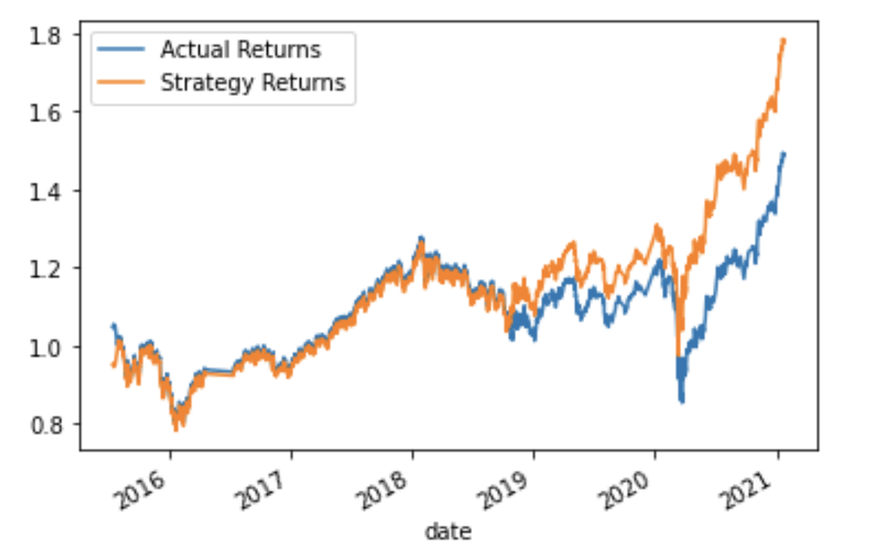
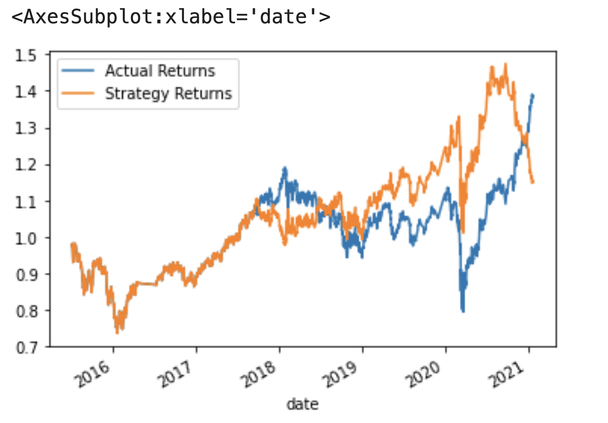

# Machine Learning Trading Bot

This code is designed to improve existing algorithmic trading systems by enhancing existing trading signals with machine learning algorithms that can adapt to new data. This approach is intended to help financial advisory firms maintain their competitive advantage in the market. 

Included in this notebook is a buy long / sell short algorithmic trading strategy that is enhanced by two different machine learning models: Support Vector Machine and Logistic Regression. The models are contrasted and compared with various parameters.

---
## Technologies

This application leverages python 3.7 with the following packages that need additional installation:

* pandas: an open-source library that offers easy-to-use data analysis tools for Python.
* matplotlib: a comprehensive library for creating static, animated, and interactive visualizations in Python.
* hvplot.pandas: a visualization library included in the PyViz package that can produce advanced charts and interactive visualizations. 
* sklearn: a Python library for machine learning and statistical modeling including tools for classification, regression, clustering and dimensionality reduction.

---
## Installation Guide

Begin by cloning the GitHub repo (the same repo that this README.md file is contained within) into your terminal. 

Then activate the correct environment by inputting the following command into your terminal:

`conda activate dev`

Within this environment, next install the above listed dependencies. To do so, in your terminal while in this same repo, enter `pip install -r requirements.txt`.

The hvPlot library needs to be installed seperately. To do so, in your terminal enter `conda install -c pyviz hvplot`.

Next, while in your IDE, open the "machine_learning_trading_bot.ipynb" notebook file and run the code. 

---
## Usage

__PART I: Establish a Baseline Performance__

This section establishes a baseline performance for the trading algorithm through the following steps:

(1) The OHLCV dataset is imported into a Pandas DataFrame.

(2) Trading signals are generated using short- and long-window SMA values.

(3) The data is split into training and testing datasets.

(4) The training data is fit to a SVC classifier model and predictions are made based on the testing data. 

(5) A classification report is generated for the SVC model predictions.

(6) A predictions DataFrame that contains columns for “Predicted” values, “Actual Returns”, and “Strategy Returns” is created.

(7) A cumulative return plot showing the actual returns vs. the strategy returns is generated.

Using a __three month-long training dataset__, a __short SMA window of four months__, and a __long SMA window of 100 months__ as a baseline parameter combination, the following cumulative returns are generated, which totaled to a __1.52x profit__ for every dollar invested:

__PART II: Tuning the Baseline Trading Algorithm__

As per the steps listed immediately below, this section tunes the baseline trading algorithm by adjusting the model’s input features to find the parameters that result in the best trading outcome. The best outcome is chosen by comparing the cumulative products of the strategy returns. 

(1) The size of the training dataset is adjusted by slicing the data into different time periods. The notebook is re-run with the updated parameters.

(2) The window length of the SMA input features are adjusted (both the short window and the long window). This notebook is re-run with the updated parameters.

__RESULTS__: The best parameters for generating the most cumulative profit for this SVM model are a __three month-long training dataset__, a __short SMA window of one month__, and a __long SMA window of 130 months__. The following cumulative returns were generated with this model and parameter combination, which totaled to a __1.78x profit__ for every dollar invested:

This is considerably better than the baseline model that generated 1.52x profit.

__PART III: Evaluate a New Machine Learning Classifier__

In this section, a new classifier is examined. The code is setup for a LogisticRegression model.

Using the original training data as the baseline model, a LogisticRegression model is fit to the training data and backtested to evaluate its performance. 

Using a __three month-long training dataset__, a __short SMA window of four months__, and a __long SMA window of 100 months__ (the baseline parameter combination), the following cumulative returns are generated:

Based off of cumulative returns with this strategy, this model underperformed our baseline, SVM model with baseline parameters as it only generated a __1.14x profit__ (baseline generated 1.52x profit).

## Evaluation Report

After trying a number of different parameter combinations (altering length of training dataset and length of SMA short and long windows) of both the SVM and the LogisticRegression models, the best model was determined to be LogisticRegression using a __three month-long training dataset__, a __two-month short SMA window__, and a __170-month long SMA window__. The following cumulative returns were generated with this model and parameter combination, which totaled to a __1.94x profit__ for every dollar invested:

---
## Contributors

Nicole Roberts,
elle.nicole.roberts@gmail.com

---
## License

[BSD 3](https://choosealicense.com/licenses/bsd-3-clause-clear/): BSD 3-clause is a permissive licence, allowing nearly unlimited freedom with the software as long as BSD copyright and license notice is included.